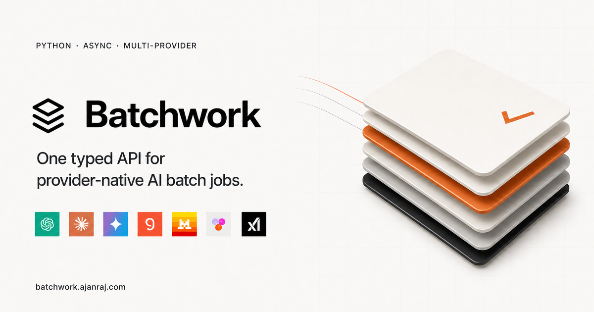

# Batchwork



Unified async batch API for OpenAI, Anthropic, Google Gemini, Groq, Mistral, Together AI, and xAI. Providers price eligible batch requests up to 50% below standard synchronous calls, and Batchwork gives you that pricing through one typed Python interface and one CLI. It handles provider-specific serialization, submission, polling, and result parsing so you do not have to. Pricing and eligibility remain provider- and model-specific.

- One typed API for provider-native batch jobs
- Text, embedding, and image workloads
- Normalized jobs, results, usage, and errors
- Messages, tools, structured content, and remote media
- Polling, persistent stores, and signed webhooks
- A `batchwork` CLI and Agent Skill for terminals, scripts, and coding agents
- No provider SDK or JavaScript runtime dependencies

📖 **Full documentation: [batchwork.ajanraj.com](https://batchwork.ajanraj.com)**

## Installation

Batchwork requires Python 3.11 or newer.

With uv:

```bash
uv add batchwork-ai
```

With pip:

```bash
pip install batchwork-ai
```

Then configure a provider credential:

```bash
export OPENAI_API_KEY="..."
```

See [Configuration](https://batchwork.ajanraj.com/docs/configuration) for every provider credential, endpoint override, model format, and batch limit.

### Command-line tool

The same package ships a `batchwork` command, so you can submit and manage batches without writing Python. Install it with `uv tool`:

```bash
uv tool install batchwork-ai
batchwork --version
```

Human quick start:

```bash
batchwork submit text prompts.txt --model openai/gpt-5
batchwork list
batchwork status BW_RECORD_ID
batchwork results BW_RECORD_ID
```

Agent and automation quick start:

```bash
batchwork --jsonl --quiet run text requests.jsonl --model openai/gpt-5
```

Machine output uses schema version 1. Global controls such as `--jsonl`, `--profile`, and `--quiet` precede the command. Preserve the first emitted job identity, capture stdout/stderr/exit status separately, and never retry an acceptance-ambiguous submission automatically. Image files are written only when `--output-dir` is explicit.

If you use a coding agent, the `batchwork-ai` Agent Skill teaches it the same contract, including when to ask before spending money and how to resume interrupted jobs:

```bash
npx skills add ajanraj/batchwork-ai@batchwork-ai
```

See the [CLI guide](https://batchwork.ajanraj.com/docs/cli), [configuration and registry reference](https://batchwork.ajanraj.com/docs/reference/cli-configuration-registry), [machine schema](https://batchwork.ajanraj.com/docs/reference/cli-machine-schema), and [exit catalog](https://batchwork.ajanraj.com/docs/guides/cli-exits).

## Quickstart

```python
import asyncio

from batchwork import BatchRequest, Batchwork


async def main() -> None:
    async with Batchwork() as client:
        job = await client.batch(
            model="openai/gpt-5.6-sol",
            requests=[BatchRequest(custom_id="hello", prompt="Say hello")],
        )
        await job.wait(timeout=3600)

        for result in await job.collect():
            print(result.custom_id, result.text)


asyncio.run(main())
```

Submitting returns a `BatchJob` immediately. Provider processing is asynchronous and may take minutes or, depending on the provider and workload, up to 24 hours.

Models use `provider/model` form. Results are correlated with requests through `custom_id`; provider output order is not guaranteed.

## Providers

Output workloads supported by Batchwork:

| Provider      | Text | Embeddings | Image generation |
| ------------- | ---- | ---------- | ---------------- |
| OpenAI        | Yes  | Yes        | Yes              |
| Anthropic     | Yes  | No         | No               |
| Google Gemini | Yes  | Yes        | Yes              |
| Groq          | Yes  | No         | No               |
| Mistral       | Yes  | Yes        | No               |
| Together AI   | Yes  | No         | No               |
| xAI           | Yes  | No         | Yes              |

Image, PDF, text-file, and audio inputs for text requests vary separately from output modalities. Provider APIs may also impose model-specific limits. See the [provider overview](https://batchwork.ajanraj.com/docs/providers) for input support, submission transport, credentials, and restrictions.

## Optional Redis store

Install the Upstash Redis integration for persistent polling state:

```bash
uv add "batchwork-ai[redis]"
# or
pip install "batchwork-ai[redis]"
```

The base package does not import or require `upstash-redis`.

## Documentation

- [Installation](https://batchwork.ajanraj.com/docs/installation)
- [Configuration](https://batchwork.ajanraj.com/docs/configuration)
- [Jobs](https://batchwork.ajanraj.com/docs/guides/jobs)
- [Results](https://batchwork.ajanraj.com/docs/guides/results)
- [Text, embeddings, and images](https://batchwork.ajanraj.com/docs/modalities/text)
- [Provider overview](https://batchwork.ajanraj.com/docs/providers)
- [Polling and webhooks](https://batchwork.ajanraj.com/docs/guides/server)
- [Stores](https://batchwork.ajanraj.com/docs/guides/stores)
- [Security](https://batchwork.ajanraj.com/docs/guides/security)
- [Examples](https://batchwork.ajanraj.com/docs/examples)
- [Public API](https://batchwork.ajanraj.com/docs/api)
- [FAQ](https://batchwork.ajanraj.com/docs/faq)

## Built with Codex and GPT-5.6

Batchwork was built entirely in the OpenAI Codex CLI with GPT-5.6 during [OpenAI Build Week](https://openai.devpost.com/) (July 2026) — the Python library, the `batchwork` CLI with its machine output contract and local job registry, the Agent Skill, the test suite, and the documentation site. Codex planned the design through a decision interview, implemented the seven provider adapters across three modalities, hardened security through repeated review loops, verified everything against live provider APIs, and drove the PyPI and documentation releases. The full collaboration story, plus a self-contained demo project for judges, lives in [`hackathon/`](hackathon/README.md).

## License

[MIT](https://opensource.org/licenses/MIT) © [Ajanraj](https://github.com/ajanraj)

## Acknowledgements

Inspired by [Hayden Bleasel's Batchwork](https://github.com/haydenbleasel/batchwork).
